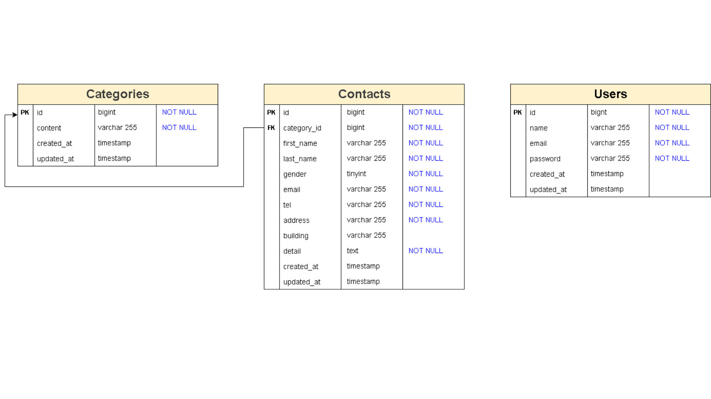

# お問い合わせフォーム

## 環境構築

1. `git clone` でリポジトリをクローン
2. `docker-compose up -d --build`
3. `docker-compose exec php bash`
4. `composer install`
5. `.env.example` をコピーして `.env` を作成
6. `.env` ファイルを必要に応じて修正
7. `php artisan migrate`
8. `php artisan key:generate`
9. `php artisan db:seed`

## 使用技術(実行環境)
- PHP 7.4.9
- Laravel 8.83.8
- MySQL 15.1
- Docker 27.5.1
- Composer  2.8.8
- Visual Studio Code (任意)

## ER図

## URL
- 開発環境：
  - http://localhost/
  - http://localhost/confirm
  - http://localhost/thanks
  - http://localhost/admin
  - http://localhost/register
  - http://localhost/login
  - http://localhost:8080